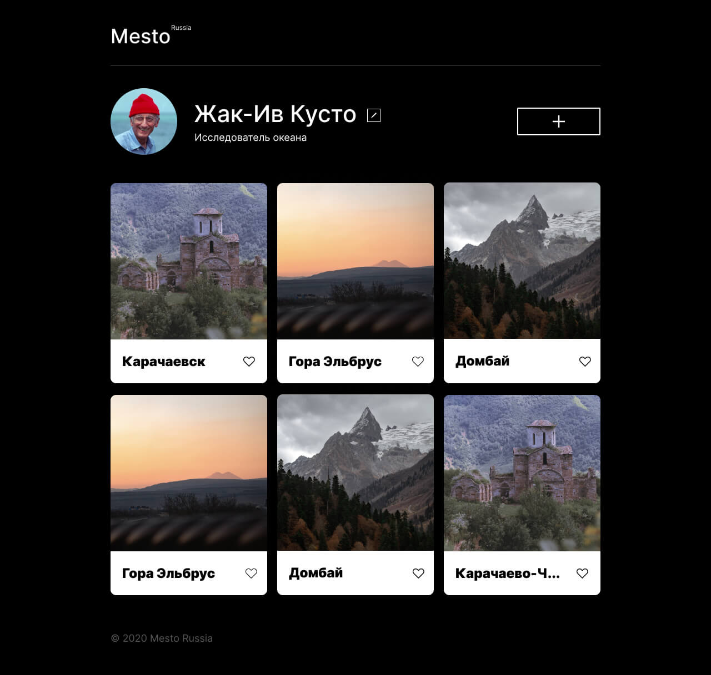

# H1 Место
https://alenazavadskaya.github.io/russian-travel/index.html 
Alt-H1
------
Это интерактивная страница, куда можно добавлять фотографии, удалять их и ставить лайки. 

  
Для определения структуры и описания содержания веб-страницы использовался **HTML**. Файловая структура проекта организована по классической **БЭМ**-технологии Nasted.
  
Внешний вид веб-контента был описан с помощью средств **CSS**. Использована технология постороения сетки **Flexbox**.
**JavaScript** придал жизни интерактивным элементам.
 
**Сайт отзывчивый, адаптирован под разрешения:** 
* **320px,** 
* **1280px.**